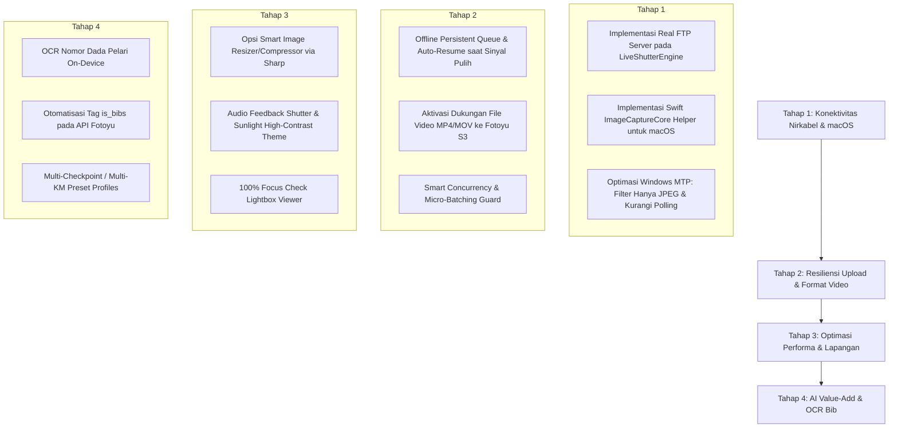

# 🚀 MASTER PLAN & ROADMAP: FOTOYU AUTO-UPLOADER PRO (FOTOSYNC PRO)

Dokumen ini memuat analisis mendalam mengenai arsitektur sistem saat ini, evaluasi kendala teknis (koneksi kabel Windows & macOS, koneksi wireless WiFi, batasan kuota upload Fotoyu), serta rekomendasi fitur dan perbaikan strategis agar aplikasi ini menjadi alat yang sangat andal, bernilai tinggi (*high-value*), dan esensial bagi fotografer event olahraga di Indonesia.

---

## 📌 1. Analisis Konteks & Problem Statement

### 1.1 Karakteristik Platform Fotoyu & Kebutuhan Fotografer
- **Fotoyu** adalah platform marketplace jual-beli foto dan video olahraga (maraton, trail running, cycling, triathlon, fun walk).
- **Kebutuhan Lapangan**: Peserta lari ingin melihat dan membeli foto mereka sesegera mungkin saat atau sesaat setelah mencapai garis finish (*race day impulse buying*). Fotografer yang mengunggah foto paling cepat memiliki tingkat konversi penjualan tertinggi.
- **Batasan Upload Resmi Fotoyu**:
  - **Aplikasi Mobile Fotoyu**: Maksimal **100 foto/video** per sesi upload.
  - **Website Fotoyu Web**: Maksimal **2.000 foto/video** per batch upload.
  - Fotografer maraton rata-rata menjepret **5.000 hingga 15.000+ foto** dalam 1 event (3–5 jam). Jika mengandalkan upload manual web/aplikasi, fotografer harus membagi-bagi folder secara manual ke dalam batch 100 atau 2.000 foto, menunggu upload selesai di kamar hotel/rumah setelah event, dan kehilangan momen emas penjualan.

### 1.2 Peran Utama Aplikasi FotoSync PRO
Aplikasi desktop ini memecahkan masalah tersebut dengan pendekatan **Continuous Live Ingest & Real-Time Stream**:
1. **Shooting Tanpa Henti**: Fotografer tetap memotret di lapangan.
2. **Auto-Ingest**: Foto dari kamera (kabel atau WiFi) otomatis ditarik ke laptop.
3. **Background Stream**: Aplikasi secara otomatis melakukan antrean (queue) dan mengunggah foto satu demi satu atau micro-batch ke AWS S3 Fotoyu via API resmi tanpa pernah terbentur limit 100/2.000 foto.

---

## 🔍 2. Evaluasi Kondisi Saat Ini & Akar Masalah Teknis

### 2.1 Masalah Koneksi Kabel (USB Direct / MTP)
Saat ini koneksi kabel hanya berjalan di **Windows**, dan belum bisa di **macOS**. Berikut penyebab teknisnya:

#### A. Kondisi di Windows Saat Ini
- File: `src/main/scripts/scan_mtp_camera.ps1` dan `src/main/liveShutterEngine.js`.
- Cara kerja: Menjalankan polling setiap **2 detik** menggunakan PowerShell `powershell.exe -ExecutionPolicy Bypass -File scan_mtp_camera.ps1 -Action sync`.
- Menggunakan COM Object Windows `Shell.Application` (`$myComputer.Items()` & `$targetFolderObj.CopyHere($item, 16 + 4)`).
- **Kelemahan**:
  1. *High CPU & Battery Drain*: Memanggil `powershell.exe` setiap 2 detik memakan CPU tinggi (proses start PowerShell memakan 500–800 ms tiap pemanggilan). Ini sangat boros baterai laptop saat fotografer di lapangan tanpa colokan listrik.
  2. *RAW File Bottleneck*: Di baris 88 `scan_mtp_camera.ps1`, script menyalin ekstensi `arw, cr2, cr3, nef, raf, dng`. File RAW berukuran 30–60 MB per jepretan, sedangkan uploader Fotoyu hanya membutuhkan file JPEG! Akibatnya kabel USB tercekik menyalin RAW yang tidak diunggah, membuat proses live shutter tertinggal jauh di belakang jepretan kamera (*lagging*).

#### B. Mengapa macOS Belum Bisa Konek Kabel?
- Di `src/main/liveShutterEngine.js` baris 161–248, kode macOS saat ini hanya memeriksa folder `/Volumes/*/DCIM`.
- **Akar Masalah**: Kamera mirrorless modern (Sony A7 IV, Nikon Z6/Z8/Z9, Canon EOS R5/R6, Fuji X-T5) saat dicolokkan ke Mac **TIDAK AKAN me-mount sebagai USB Drive di `/Volumes`**! macOS mengenali kamera sebagai perangkat **PTP/MTP (Picture Transfer Protocol)** melalui Apple Core Framework (*ImageCaptureCore*).
- Kode yang ada saat ini hanya memanggil `system_profiler SPUSBDataType` yang sebatas mencetak nama kamera ke console, tanpa memiliki driver/protokol untuk menarik file foto dari kamera.

---

### 2.2 Masalah Koneksi Wireless / WiFi
Di aplikasi saat ini, fitur WiFi belum berfungsi untuk kamera. Berikut penyebab teknisnya:
- Di `src/main/liveShutterEngine.js` baris 368, aplikasi membuat server menggunakan `http.createServer(...)` pada port 2121 (protokol **HTTP**).
- Pada UI aplikasi (`src/renderer/index.html`), instruksi panduan menuliskan:
  - *Sony: Network -> FTP Transfer Func -> IP & Port 2121*
  - *Nikon: Network Settings -> Connect to FTP Server -> IP & Port 2121*
  - *Canon: Network Settings -> FTP Transfer -> IP & Port 2121*
- **Akar Masalah**:
  - Kamera profesional Sony, Nikon, Canon, dan Fujifilm **TIDAK menggunakan protokol HTTP** untuk auto-transfer foto!
  - Kamera-kamera tersebut menggunakan protokol **FTP / FTPS (RFC 959 File Transfer Protocol)** standar (perintah: `USER`, `PASS`, `PORT`, `PASV`, `STOR filename.jpg`).
  - Ketika kamera mencoba menghubungi server laptop pada port 2121 dengan perintah FTP handshake, `http.createServer` menolaknya karena menganggap itu bukan request HTTP yang valid. Koneksi langsung putus (*connection refused / protocol error*).

---

### 2.3 Evaluasi Pipeline Upload Fotoyu API Saat Ini
- File: `src/main/uploaderEngine.js`.
- Alur yang dipakai:
  1. `POST https://api.fotoyu.com/gs/v3/creations/link` -> Mendapatkan Presigned AWS S3 URL & `upload_key`.
  2. `PUT <presigned_url>` -> Mengunggah binary JPEG langsung ke AWS S3.
  3. `POST https://api.fotoyu.com/gs/v4/creations` -> Registrasi metadata (harga, lokasi, deskripsi, timestamp, `tag_ids`).
- **Evaluasi**:
  - Alur 3-step ini sudah benar dan sesuai dengan arsitektur Fotoyu Web.
  - Namun, pengunggahan dilakukan secara **1 foto per 1 siklus request lengkap**. Jika fotografer memasukkan SD card berisi 3.000 foto sekaligus, aplikasi melakukan 9.000 HTTP requests berurutan. Diperlukan opsi micro-batching atau concurrent workers yang dinamis agar tidak terkena *Rate Limit (HTTP 429)* dan tidak membuat laptop *hang*.

---

## 🛠️ 3. Rencana Perbaikan & Solusi Teknis (Apa yang Harus Diperbaiki)

### 3.1 Solusi Koneksi Nirkabel (WiFi Wireless) untuk Semua Merk Kamera
Untuk membuat koneksi wireless bekerja 100% pada Sony, Nikon, Canon, dan Fuji:
1. **Ganti HTTP Server dengan True Embedded Node.js FTP Server**:
   - Gunakan library FTP murni seperti `ftp-srv` atau modul socket FTP kustom ringan berbasis TCP.
   - Buka port FTP standar kamera: port `21` (atau port alternatif `2121` jika port 21 membutuhkan izin administrator).
   - Server FTP mengizinkan koneksi Anonymous atau username/password sederhana (`fotoyu` / `fotoyu`).
2. **Event Hook saat Foto Masuk**:
   - Ketika kamera mengirimkan foto via perintah `STOR DSC_0001.JPG`, server FTP langsung menulis file ke folder target ingest.
   - Begitu transfer file selesai (`finish` / `close` event), emit event `onLiveShutterReceived` secara instan (latensi < 100 ms).
   - Foto langsung masuk antrean uploader tanpa perlu menunggu scanning folder.
3. **Pertahankan Web HTTP Portal sebagai Fitur Tambahan**:
   - Web portal yang sudah ada tetap dipertahankan pada port lain (misal port 8080) untuk memungkinkan asisten fotografer / runner mengunggah foto via browser smartphone mereka (fitur *Companion Mobile Upload*).

### 3.2 Solusi Koneksi Kabel USB di macOS
Untuk menyelesaikan masalah kabel USB di macOS agar kamera otomatis terdeteksi seperti di Windows:
1. **Pendekatan Rekomendasi: Native macOS Swift Helper (`ImageCaptureCore`)**:
   - Buat file Swift ringan (`mac_camera_bridge.swift` atau binary terkompilasi `camera-bridge-mac`).
   - Menggunakan framework resmi Apple: `ImageCaptureCore` (`ICDeviceBrowser` & `ICCameraDeviceDelegate`).
   - Script ini berjalan di background process Electron pada macOS:
     - Mendeteksi kamera yang dicolokkan melalui USB (Sony, Canon, Nikon, dll).
     - Menerima event native `cameraDevice:didAddItems:`.
     - Setiap jepretan kamera langsung di-download otomatis ke folder ingest dalam waktu sekejap (< 0.5 detik).
     - **Keuntungan**: Zero-dependency eksternal, performa native Apple, tidak memakan daya baterai, dan tidak membutuhkan card reader.
2. **Pendekatan Alternatif: PTP/gphoto2 Engine**:
   - Bundle binary CLI portabel `gphoto2` untuk macOS (arm64 & x64).
   - Perintah: `gphoto2 --wait-event-and-download --filename "%Y%m%d_%H%M%S_%n.%C"`.
   - Bekerja secara otomatis untuk ratusan model kamera PTP.

### 3.3 Optimasi Koneksi Kabel USB di Windows
1. **Eliminasi Overhead PowerShell**:
   - Jangan spawn proses `powershell.exe` baru setiap 2 detik.
   - Ubah menjadi skrip PowerShell **persistent background process** yang berkomunikasi dua arah via `stdin/stdout` JSON line, atau gunakan polling WPD event / Win32 drive change API.
2. **Filter Ekstensi File Ketat (Hanya Salin JPEG)**:
   - Modifikasi `scan_mtp_camera.ps1` baris 88 agar **hanya menyalin file `.jpg` dan `.jpeg`**.
   - Lewatkan file RAW (`.arw`, `.cr2`, `.cr3`, `.nef`, `.raf`). Ini akan melipatgandakan kecepatan transfer USB hingga 5x–10x lebih cepat.

---

## 💎 4. Fitur-Fitur Baru yang Harus Ditambahkan (Value Multipliers)

Agar fotografer merasa aplikasi ini **sangat berguna, bernilai tinggi, dan rela berlangganan**, berikut adalah fitur-fitur yang harus ditambahkan:

### 4.1 AI Bib Number (Nomor Dada Pelari) Auto-Tagging
- **Urgensi**: Nilai jual utama foto lari di Fotoyu adalah kemudahan pelari mencari nomor dadanya (*BIB Number*). Di kode saat ini, `is_bibs: []` masih dikosongkan.
- **Fitur Baru**:
  - Integrasikan library OCR on-device ringan (misalnya Tesseract.js atau model Vision OCR berbasis ONNX) yang berjalan di background thread laptop.
  - Saat foto masuk dari kamera, sistem membaca nomor di dada pelari (misal: "1024", "452").
  - Otomatis mengisi array `is_bibs: ["1024"]` pada payload registrasi Fotoyu API (`/gs/v4/creations`).
  - **Dampak**: Foto fotografer langsung terindeks nomor dada secara instan di marketplace Fotoyu, meningkatkan potensi penjualan foto hingga 300%!

### 4.2 Dukungan Upload Video (Reels & Finish Line Clips)
- **Urgensi**: Fotoyu menyediakan fitur jual video, dan UI aplikasi sudah memiliki kolom "Harga per Video", tetapi saat ini uploader menolak file video.
- **Fitur Baru**:
  - Tambahkan dukungan ekstensi `.mp4`, `.mov`.
  - Ekstraksi thumbnail video otomatis (menggunakan `ffmpeg` portabel atau HTML5 `<video>` canvas).
  - Tentukan alur registrasi S3 video di Fotoyu API untuk konten video.

### 4.3 Smart Offline Buffer & Auto-Resume Resilience
- **Urgensi**: Fotografer event sering berada di lokasi minim sinyal (hutan/trail run, pegunungan, area terbuka tanpa WiFi stabil).
- **Fitur Baru**:
  - **Local SQLite / Persistent Disk Buffer**: Jika koneksi internet terputus di tengah event, kamera tetap bisa memotret dan foto tetap tersimpan rapi di antrean lokal tanpa status `failed`.
  - **Auto-Detect Reconnection**: Begitu modem/hotspot terhubung kembali, aplikasi secara otomatis melanjutkan upload tanpa perlu klik manual tombol "Retry Failed".
  - **Bandwidth Throttler**: Pengaturan batas kecepatan upload agar tidak menghabiskan bandwidth hotspot ponsel fotografer secara tiba-tiba.

### 4.4 Smart Compression & Web-Optimized Resizing (Opsional)
- **Urgensi**: Kamera modern menghasilkan file JPEG sebesar 20–35 MB per foto. Mengunggah 10.000 foto x 25 MB membutuhkan kuota internet ~250 GB di lokasi event!
- **Fitur Baru**:
  - Sediakan opsi toggle: *"Optimasi Ukuran Foto Sebelum Upload"* (menggunakan library `sharp` di Node.js).
  - Mengubah ukuran foto ke resolusi optimal marketplace (misal: sisi terpanjang 4000px, JPEG quality 85–90%).
  - Mengurangi ukuran file dari 25 MB menjadi 3–4 MB tanpa penurunan kualitas kasat mata. Kecepatan upload naik 6x lipat lebih cepat.
  - Opsi: Simpan file original di disk laptop fotografer sebagai arsip master.

### 4.5 Dual Slot Camera Workflow (RAW Backup + JPEG Ingest)
- Kebanyakan fotografer menggunakan kamera dual card slot:
  - **Slot 1 (SD/CFExpress)**: RAW (arsip pribadi resolusi tertinggi).
  - **Slot 2 (SD)**: JPEG Small/Medium (khusus untuk streaming upload Fotoyu).
- Aplikasi menyediakan konfigurasi pintar untuk mengenali skenario ini sehingga fotografer merasa aplikasi ini dibuat oleh sesama profesional yang mengerti alur kerja lapangan.

### 4.6 Tampilan Khusus Lapangan: High-Contrast Outdoor (Sunlight Mode) & Audio Shutter
- **Sunlight Mode**: Fotografer sering bekerja di bawah terik matahari maraton di mana layar laptop gelap susah dibaca. Sediakan mode tema *"Ultra High-Contrast Daylight"* dengan teks hitam tebal di atas latar putih bersih.
- **Audio Feedback**: Bunyi *chime* atau suara klik shutter laptop setiap ada foto baru yang berhasil ditarik dari kamera, sehingga fotografer yang sedang berdiri 2–3 meter dari laptop tahu bahwa jepretannya sudah masuk ke sistem tanpa harus menatap layar terus-menerus.
- **100% Focus Inspection Widget**: Klik cepat pada foto terakhir untuk melihat zoom 100% di area wajah/mata guna memastikan fokus kamera tepat sasaran.

---

## 🗺️ 5. Rencana Tahapan Implementasi (Roadmap Eksekusi)

Berikut adalah tahapan implementasi yang terstruktur dari prioritas tertinggi ke fitur penyempurna:



---

## 💻 6. Cetak Biru Teknis (Technical Blueprints)

### 6.1 Arsitektur FTP Server Nirkabel (`ftpServer.js`)
Alih-alih `http.createServer`, implementasi server FTP untuk mendengarkan jepretan kamera:

```javascript
// Konsep implementasi FTP Server menggunakan ftp-srv di Node.js
const FtpSrv = require('ftp-srv');
const path = require('path');
const fs = require('fs');

class CameraFtpServer {
  constructor(port = 2121, targetDir, onFileReceived) {
    this.port = port;
    this.targetDir = targetDir;
    this.onFileReceived = onFileReceived;
    this.ftpServer = null;
  }

  async start(localIp) {
    this.ftpServer = new FtpSrv({
      url: `ftp://${localIp}:${this.port}`,
      pasv_url: localIp,
      pasv_min: 1024,
      pasv_max: 1050,
      anonymous: true // Izinkan kamera login tanpa ribet
    });

    this.ftpServer.on('login', ({ connection, username, password }, resolve, reject) => {
      // Izinkan akses read/write ke folder target ingest
      resolve({ root: this.targetDir });
    });

    this.ftpServer.on('client-error', ({ connection, context, error }) => {
      console.warn('[FTP Client Error]:', error.message);
    });

    // Event saat kamera selesai mengunggah file foto (STOR)
    // File otomatis tersimpan di targetDir dan langsung diproses uploader
    await this.ftpServer.listen();
    console.log(`[FTP] Server Kamera Siap pada ftp://${localIp}:${this.port}`);
  }

  stop() {
    if (this.ftpServer) {
      this.ftpServer.close();
      this.ftpServer = null;
    }
  }
}
```

### 6.2 Arsitektur macOS Native Bridge (`mac_camera_bridge.swift`)
Skrip Swift mandiri menggunakan framework resmi Apple `ImageCaptureCore`:

```swift
import Foundation
import ImageCaptureCore

class CameraWatcher: NSObject, ICDeviceBrowserDelegate, ICCameraDeviceDelegate {
    let browser = ICDeviceBrowser()
    let destinationURL: URL
    
    init(targetPath: String) {
        self.destinationURL = URL(fileURLWithPath: targetPath)
        super.init()
        browser.delegate = self
        browser.browsedDeviceTypeMask = ICDeviceTypeMask(rawValue: 
            ICDeviceTypeMask.camera.rawValue | ICDeviceLocationTypeMask.local.rawValue)!
        browser.start()
    }
    
    func deviceBrowser(_ browser: ICDeviceBrowser, didAdd device: ICDevice, moreComing: Bool) {
        if let camera = device as? ICCameraDevice {
            print("{\"event\":\"connected\", \"camera\":\"\(camera.name ?? "Camera")\"}")
            camera.delegate = self
            camera.requestOpenSession()
        }
    }
    
    func cameraDevice(_ camera: ICCameraDevice, didAdd items: [ICCameraItem]) {
        for item in items {
            guard let file = item as? ICCameraFile else { continue }
            let ext = (file.name as NSString).pathExtension.lowercased()
            // Hanya tarik foto JPEG, abaikan RAW agar instan
            if ext == "jpg" || ext == "jpeg" {
                let options: [ICDownloadOption: Any] = [
                    .targetDirectory: destinationURL,
                    .saveAsFilename: file.name
                ]
                camera.requestDownloadFile(file, options: options, downloadDelegate: self) { error, path in
                    if error == nil {
                        print("{\"event\":\"downloaded\", \"file\":\"\(file.name)\", \"path\":\"\(path)\"}")
                    }
                }
            }
        }
    }
}
```

---

## 🎯 7. Kesimpulan & Rekomendasi Langkah Awal

1. **Perbaikan Mendesak (Tahap 1)**:
   - Pasang real FTP Server di `liveShutterEngine.js` agar kamera Sony, Nikon, Canon bisa langsung konek via WiFi tanpa perlu kabel.
   - Tambahkan helper Swift / ImageCaptureCore untuk macOS agar pengguna Mac bisa konek kabel USB layaknya di Windows.
   - Ubah `scan_mtp_camera.ps1` agar **hanya menyalin file JPEG**, tidak menyalin RAW berukuran puluhan megabyte.

2. **Peningkatan Nilai Produk (Tahap 2 & 3)**:
   - Tambahkan **Offline Buffer & Auto-Resume** agar aman saat internet lapangan terputus.
   - Tambahkan **AI Bib Number OCR** agar foto otomatis terindeks nomor dada pelari di Fotoyu.
   - Aktifkan dukungan **Upload Video**.

Dengan roadmap dan arsitektur di atas, aplikasi **FotoSync PRO** akan bertransformasi dari sekadar folder watcher biasa menjadi **Solusi Lengkap (*All-in-One Live Ingest Suite*)** yang wajib dimiliki oleh setiap fotografer event maraton dan olahraga di Indonesia.
